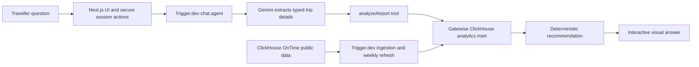

# Gatewise

**Know when to arrive—not just how early.**

Gatewise turns a U.S. domestic flight question into a visual, data-backed
airport-arrival recommendation. Instead of returning another wall of text, it
shows one clear arrival window with an explorable timeline, hourly airport
pressure curve and the evidence behind every added minute.

[Live demo](https://gatewise.pli9qubac.chatgpt.site/) ·
[Source code](https://github.com/JiamingZhang-57/gatewise) ·
[MIT License](LICENSE)

## Try it

Ask Gatewise:

> I have a U.S. domestic flight from JFK tomorrow at 09:00. Carry-on only, and
> I have TSA PreCheck. When should I arrive?

Gatewise returns:

- A single data-informed arrival time.
- The official two-hour domestic guideline for comparison.
- A transparent breakdown of the baseline, checked-bag and historical-pressure
  buffers.
- An interactive 24-hour airport activity curve.
- Historical delay, cancellation and sample-size evidence.

## Why it fits “Beyond the Wall of Text”

The response itself is the product. The traveller sees the verdict first, then
explores the timeline and evidence without reading a forecast dump or a long
chat answer. Text is used only to collect missing trip details and explain the
limits of the result.

## How it works



The model never writes SQL and never invents the recommendation. Gemini is used
to understand the traveller's language and produce a strictly validated tool
call; the final timing calculation remains deterministic and data-backed.

## Meaningful use of ClickHouse

- ClickHouse OnTime provides the public historical flight source.
- A Trigger.dev ingestion task aggregates the source by airport, month,
  weekday and scheduled departure hour.
- The app-owned ClickHouse Cloud mart stores average departures, busy-day
  volume, delay rate, cancellation rate and sample size.
- User-facing analysis queries the team's own mart rather than sending every
  chat request to the public Playground.
- ClickHouse also stores short-lived usage events used to protect the public
  hackathon demo.

## Meaningful use of Trigger.dev

- `airport-arrival-chat` runs the live multi-turn agent and streams tool results
  to the interface.
- `seed-airport-stats` performs resilient ClickHouse OnTime ingestion.
- `weekly-airport-stats-refresh` refreshes the mart every Monday at 04:00 UTC
  in staging and production.
- Typed tools, retries, task observability and queue concurrency keep model,
  data and frontend work separated and inspectable.

## Supported scope

Gatewise currently supports U.S. domestic departures from 13 airports:

`ATL` · `BOS` · `DFW` · `DEN` · `EWR` · `JFK` · `LAX` · `LAS` · `MCO` ·
`MIA` · `ORD` · `SEA` · `SFO`

The agent requires six explicit trip details: origin airport, departure date,
scheduled local departure time, confirmation that the flight is U.S. domestic,
checked-bag status and TSA PreCheck status. If anything is missing, it asks one
short combined follow-up question.

## Recommendation model

Gatewise compares the selected airport, travel month, weekday and departure
hour across 2015–2025, excluding 2020–2021. The visible formula starts from the
official 120-minute domestic-flight baseline and adds:

- **Checked bag:** 15 minutes. This is a Gatewise handling margin, not an
  airline rule.
- **Below the 50th airport-hour traffic percentile:** 0 minutes.
- **50th–79th percentile:** 15 minutes.
- **80th percentile or above:** 30 minutes.

TSA PreCheck is displayed but never subtracts a fixed number of minutes because
expedited screening is not guaranteed on every trip. The interface always
shows both the data-informed comfort target and the official two-hour line.

### Important limitation

This is a historical flight-activity estimate, not a live security-queue
prediction. The OnTime dataset does not include passenger arrival, check-in,
security, road traffic or airport walking-time observations. Travellers should
still verify their airline's check-in and baggage cut-offs and check live
airport conditions.

## Technology

- **Frontend and backend:** Next.js, React and secure Server Actions.
- **Agent and orchestration:** Trigger.dev and AI SDK.
- **Natural-language extraction:** Gemini.
- **Real-time analytical layer:** ClickHouse Cloud.
- **Historical source:** ClickHouse OnTime.
- **Production hosting:** OpenNext on Codex Sites.

## Run locally

Install dependencies and copy the example environment file:

```powershell
pnpm install
Copy-Item .env.example .env
```

Add credentials for the team's ClickHouse Cloud service, Trigger.dev
development environment and Google AI Studio project. Never expose
`TRIGGER_SECRET_KEY`, `GOOGLE_GENERATIVE_AI_API_KEY` or ClickHouse credentials
in frontend code.

Run [`clickhouse/schema.sql`](clickhouse/schema.sql) once in the ClickHouse
Cloud SQL console before starting the app. Schema changes are deployed there
instead of running DDL in the user-facing request path.

Open two terminals in the project root:

```powershell
pnpm trigger:dev
```

```powershell
pnpm dev
```

Then open [http://localhost:3000](http://localhost:3000).

## Seed the analytics mart

Run the `seed-airport-stats` task from the Trigger.dev dashboard. It reads the
public OnTime source and writes the aggregates into:

```text
gatewise.airport_hour_stats
```

The table uses `ReplacingMergeTree(updated_at)` so refreshes are idempotent at
the airport/month/weekday/hour grain.

## Demo safeguards

- Chat input is text-only and limited to 600 characters.
- Each chat is limited to six model turns.
- Session starts are limited per visitor and globally.
- Browser access uses short-lived, chat-scoped Trigger.dev tokens.
- The Trigger.dev agent queue has a concurrency limit of two.

## Verify

```powershell
pnpm test
pnpm typecheck
pnpm build
```

## Rule sources

- [TSA travel tips](https://www.tsa.gov/news/press/factsheets/tsa-travel-tips)
  — travellers are encouraged to arrive two hours before departure.
- [American Airlines U.S. check-in guidance](https://www.aa.com/i18n/travel-info/check-in-and-arrival.jsp?locale=en_US)
  — two-hour domestic arrival guidance and common check-in cut-offs.
- [Delta U.S. check-in guidance](https://www.delta.com/us/en/check-in-security/check-in-time-requirements/domestic-check-in)
  — two-hour guidance plus airport-specific baggage exceptions.

Rules were last checked on 2026-07-20.

## License

[MIT](LICENSE)
